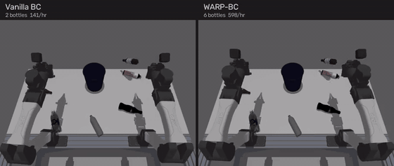

# WARP-RM — Warp-Augmented Relative Progress Reward Model

[Project Page](https://uynitsuj.github.io/warp-rm/) &ensp;|&ensp; [arXiv:2606.28320](https://arxiv.org/abs/2606.28320)

WARP-RM learns a dense, signed relative-progress signal ($v_t$) from robot manipulation videos: per frame, *how fast and in which direction* a task is advancing ($v_t \approx 1$ at expert pace, $\approx 0$ while stalling, $< 0$ while regressing). It feeds a frozen DINOv3 backbone into a bidirectional Transformer trained via self-supervised time-warp augmentations (WARP). The output scores are used downstream by **WARP-BC** to filter and reweight behavior-cloning action chunks.

---

## Installation

```bash
git clone https://github.com/uynitsuj/WARP-RM.git && cd WARP-RM
uv sync                       # core (training + scoring)
uv sync --extra wandb         # optional W&B logging
```

Requires Python ≥ 3.10 and a CUDA GPU. Authenticate with HuggingFace to access the gated DINOv3 backbone:

```bash
hf auth login
```

---

## Quickstart

### 1. Train on a LeRobot Dataset
```bash
# Real T-shirt folding setup
python scripts/train.py --lerobot-repo /path/to/your/lerobot/dataset

# Simulation setup (SSS15)
python scripts/train.py --ablation no_abs --feature-stride 1 \
    --source-standard-stride 15 --max-steps 20000 \
    --shortest-frac 0.25 \
    --object-counts-json /path/to/sim-bottles-mjwarp-v1/meta/object_counts.json \
    --lerobot-repo /path/to/your/lerobot/dataset
```

### 2. Score & Inject Reward Columns
```bash
python scripts/data/write_warp_rm_annotations.py \
    --checkpoint checkpoints/best_model_<tag>.pt \
    --lerobot-repo /path/to/your/lerobot/dataset
```

### 3. Interactive Web Inspector
```bash
uv sync --extra webui
python scripts/webui/server.py \
    --checkpoint checkpoints/best_model_<tag>.pt \
    --dataset-root /path/to/datasets
```

---

## Paper Simulation Results

Evaluated on a simulated bottle-in-bin environment (**512 paired scenes $\times$ 6 bottles, 60s horizon**). All methods train on the same policy architecture and 31.5% retention budget, differing only in chunk selection.

| Method | Data Kept | Bottles/Scene | Thrpt (/hr) | All 6 Cleared |
|---|---|---|---|---|
| Vanilla BC | 100% | 3.885 | 237 | 9.4% |
| Random | 31.5% | 3.770 | 230 | 10.9% |
| ReWiND | 31.5% | 3.781 | 231 | 9.4% |
| SARM (oracle) | 31.5% | 4.191 | 265 | 20.5% |
| WARP-BC (IID) | 31.5% | 4.285 | 269 | 18.9% |
| SCIZOR | 31.5% | 4.299 | 270 | 19.1% |
| DemInf | 31.5% | 4.332 | 271 | 18.8% |
| **WARP-BC** | 31.5% | **4.533** | **290** | **25.0%** |

<p align="center">
  
</p>

---

## Full Reproduction Pipeline

To reproduce the full pipeline end-to-end across companion repositories:

```bash
# 1. Training + batched rollout
git clone https://github.com/uynitsuj/abc-rabc.git && git -C abc-rabc checkout 59db543d
git clone https://github.com/uynitsuj/openpi.git openpi-train && git -C openpi-train checkout 9c8e7b75

# 2. Verify the scorer reproduces the locked table.
#    Uses the n=128 deterministic set: --self-test asserts those exact cells
#    (n==128, 3.98 -> 4.67, diff 0.695) and will NOT accept the n=512 set.
#    score_bottles.py lives on release-candidate, not on the branch above.
git clone https://github.com/uynitsuj/abc-rabc.git abc-rabc-score \
  && git -C abc-rabc-score checkout 9a9fbb5b
hf download uynitsuj/paper-sim-n128-traces --repo-type dataset --local-dir traces/paper-sim-n128
python abc-rabc-score/score_bottles.py --trace-dir traces/paper-sim-n128 --self-test

# 3. The n=512 traces behind the table above (score without --self-test)
hf download uynitsuj/paper-sim-n512-traces --repo-type dataset --local-dir traces/paper-sim-n512
```

> The self-test is a **scorer-integrity check**, not the headline result: it
> asserts the locked n=128 cells under the paper's scoring rule, which is why
> its numbers (3.98 → 4.67) differ from the n=512 table above (3.885 → 4.533).

See [`docs/reproduce_sim.md`](docs/reproduce_sim.md) for detailed instructions on training $\pi_0$ policies, applying the chunk gate, and running batched MuJoCo rollouts.

---

## Repository Structure

```
WARP-RM/
├── scripts/
│   ├── train.py                      # Training entrypoint
│   ├── data/                         # Precomputation & annotation scripts
│   ├── eval/                         # Scoring & rendering
│   └── webui/                        # Visual inspector server
├── warp_rm/                          # Models, data pipelines, & losses
└── docs/                             # Recipes, schema, & metric definitions
```

---

## Citation

```bibtex
@article{yu2026warp,
  title={WARP-RM: A Warp-Augmented Relative Progress Reward Model for Data Curation},
  author={Yu, Justin and Goldberg, Andrew and Kondap, Kavish and El-Refai, Karim and Ransing, Ethan and Chen, Qianzhong and Schwager, Mac and Shentu, Fred and Wu, Philipp and Goldberg, Ken},
  journal={arXiv preprint arXiv:2606.28320},
  year={2026}
}
```

## License

[MIT License](LICENSE)
